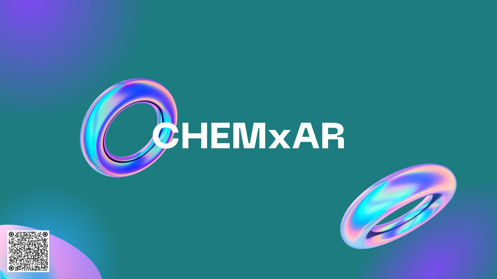

# AR-Chemistry-Learning-App-ChemAR
A learning app for chemistry periodic tables.
The main goal is to promote learning by interacting and discovery with the aid of AR technology.
[Presentation Slides and Video Here](https://www.canva.com/design/DAFB4V2j86M/w5V7jiRAhfP3PLQGaukqUw/view?utm_content=DAFB4V2j86M&utm_campaign=designshare&utm_medium=link&utm_source=editor)

